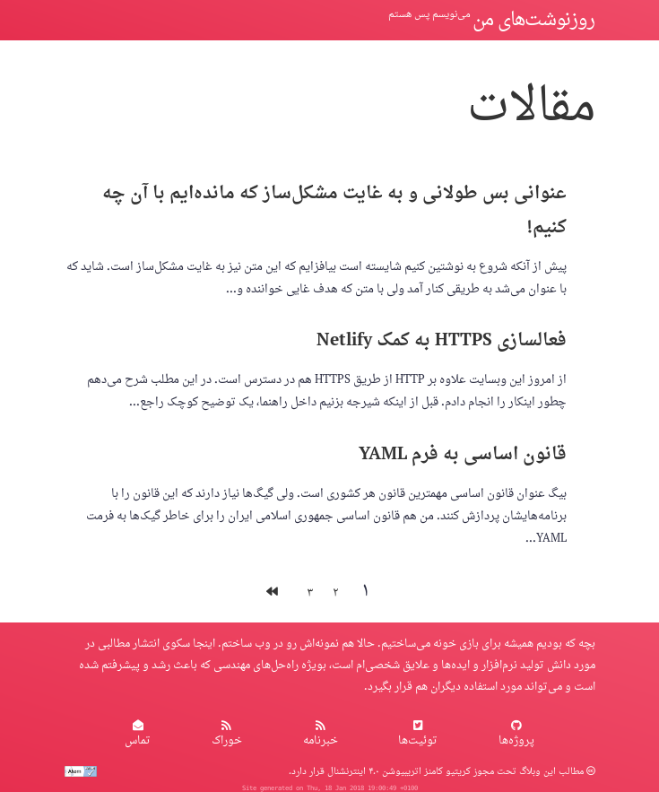

# jekyll-theme-mehdix-rtl [](https://badge.fury.io/rb/jekyll-theme-mehdix-rtl)



This is the jekyll theme used for my personal Persian [website](http://mehdix.ir). Persian aka Farsi is written right-to-left, however some people use Roman script to write Persian language in messaging applications and social networks.

During the last few years people have reached out to me asking how to setup a persian Jekyll website with Jalali calendar support. Since Jekyll now supports themes, I created this theme based on my website to help others to bootstrap their own websites.

This repository can be of use to anybody willing to build a new right to left website. I gradually fix issues which I came across while writing new posts in my website. This website is produced using [Jekyll](http://jekyllrb.com/) static site generator.

## Installation

Take the following steps to make your own website based on this theme. First of all, create your website if you have not already:


    $ jekyll create mywebsite


Then add this line to your Jekyll site's Gemfile:

```ruby
gem "jekyll-theme-mehdix-rtl"
```

And add this line to your Jekyll site's `_config.yml`:

```yaml
theme: jekyll-theme-mehdix-rtl
```

And then execute:

    $ bundle

Or install it yourself as:

    $ gem install jekyll-theme-mehdix-rtl


You can override theme style by creating matching files with the same structure inside your Jekyll source tree. See Jekyll [Themes docs](https://jekyllrb.com/docs/themes/) for more information on that.


## Further customization

### Styles
You can create a `_sass` folder and put a file named `custom.scss` in it. This theme will load it by default.

### Layouts
The following layouts are available for your homepage:
- home: post titles along with an excerpt and pagination
- minimal: only post titles

### Comments
In order to enalbe disqus comments add `disqus_shortname` to your `_config.yml` file and define your disqus username.

### Forcing RTL code blocks
If you put code blocks and they appear incorrectly, you can use _Markright gem. First add it to your Gemfile:

```ruby
gem "jekyll-markright"
```

And change your __config.yml_ respectively:

```yaml
markdown: Markright
```

### Footer
If any of the following ids is present in the config a corresponding item will be added to the footer:

- github_username
- twitter_username
- feedburner_id
- email

### Analytics
In order to send pageviews to Google Analytics set your ID in the `_config.yml`: `google_analytics_id: YOUR_ID`


## License

[MIT](http://opensource.org/licenses/MIT)

<div dir="rtl" lang="fa">

## در مورد فارسی‌نویسی
در هنگام گزارش مشکلات یا شرح تغییرات، فارسی نوشتن خیلی هم خوب است. فقط یک شرط دارد! متن را درون تگ راست به چپ شده بنویسید که درست نمایش داده بشود. اگر هم دوست دارید انگلیسی بنویسید هیچ اشکالی ندارد.

</div>

    <div dir="rtl" lang="fa">مطلب مورد نظر</div>